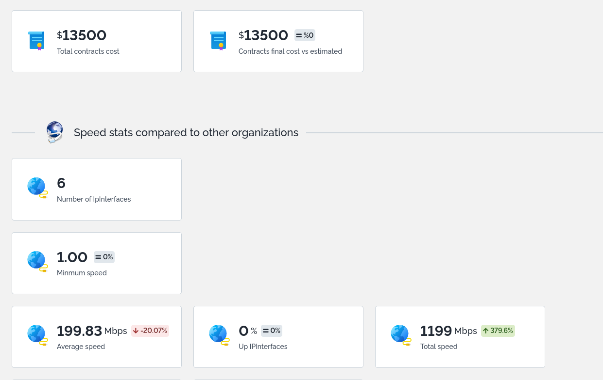

### AHalfWildSheep's Dashlet Statistics
This extension brings to your iTop 2 new dashlets: DashletStats and DashletStatsCompare.

DashletStats is an extended version of iTop's own dashlet badge but brings along aggregate function (such as max, min, avg..) and allows your to filter these dashlets with an OQL. These dashlets are clickable and redirects to the objects it uses.

DashletStatsCompare is an extended version of DashletStats allowing you to compare 2 OQL with the former functions.

## Dashlet options
DashletStats options
* Title: A basic title for the dashlet
* Query: An OQL query to filter on which objects your dashlet will work
* Aggregate function: A function that will be used to combine your objects in a single number (Average, Count, Maximum, Minimum, Percentage, Sum)
* Aggregate attribute: Some of the above function needs an object's attribute to do their calculation (Average, Maximum, Minimum, Sum). It must be an attribute (Decimal, Duration, Integer, Percentage, SubItem)
* Unit: A unit to provide if you want your dashlet (Average, Maximum, Minimum, Sum) to display a unit next to dashlet value
* Unit position: Specify where you want to put your unit (Before, After) on you dashlet  (Average, Maximum, Minimum, Sum)
* Percentage Query: An OQL used with the dashlet (Percentage) in order to compare your `Query` with the `Percentage Query`

DashletStatsCompare options
DashletStatsCompare inherits all above options and adds:
* Compare Query: An OQL on which a delta will be computed compared to `Query`
* Compare Unit: Whether your delta between `Query` and `Compare Query` will be displayed as (Difference, Percentage)
* Percentage Compare Query: An OQL used with the dashlet (Percentage) in order to compare your `Query` computed with `Percentage Query` and `Compare Query` computed with `Percentage Compare Query`

## Installation

* Extract `ahws-dashlet-stats` to your extension folder
* Run a setup

You can now use these dashlets with these dashlet icons in your dashboard editor:

## Example
In this example I used IPInterface class with its Speed attribute.

Top 2 rows are DashletStats dashlets while bottom 2 rows are DashletStatsCompare dashlets.

I added a `Mbps` unit where applicable, and obviously displayed after the value.
I compared them to other organizations IPInterface in the second part of the table, and I got a nice delta view for each DashletStatsCompare dashlet.

## Compatibility
Min version is now  3.1.0 as I used the [`<themes_common>` XML node](https://www.itophub.io/wiki/page?id=latest:customization:xml_reference#158).
Legacy browser are [probably not supported](https://caniuse.com/flexbox) as I used Flexbox for display

Thanks to [icons8](https://icons8.com/) for their icons 👍